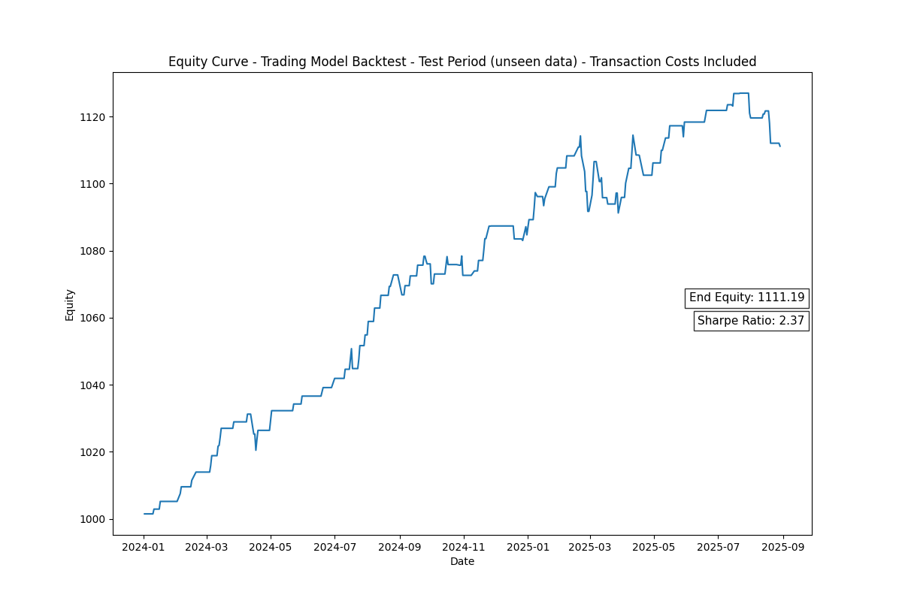

# Nasdaq ML Trading Project

A hybrid machine learning model that predicts the daily high and low 
of the Invesco QQQ ETF and further utilizing this prediction in a trading model.

## Motivation
Combining my interest in Data Science, Machine Learning and Finance, by which I am 
trying to gain an edge in the financial markets.

## Process
1. Machine Learning Model:
- Data Loading: QQQ OHLCV data and macroeconomic rates
- Data Preprocessing: Combining and cleaning the data from the different sources
- Feature Engineering: Adding lag, time step and seasonal features
- Model Training and Tuning: Combining Linear Regression model and XGBoost model
- Model Testing: Testing the accuracy of the model on unseen data

---> **Daily High and Low predictions**

2. Trading Model:
- Model Building and Tuning: Utilizing the range given by the High and Low 
predictions to trade
- Model Testing: Backtesting the model on out-of-sample data

## Results
**Evaluation Period: 01.01.2024 - 31.08.2025**
- Out-of-Sample Return: 10.6%

## Next Steps

- Testing the model on real-time data
- Evolving the tuning of the Trading Model and potentially the training of the ML Model into a rolling
window approach

**Click [here](docs/technical_insights.md) to dive deeper into the technical aspects of the project** 