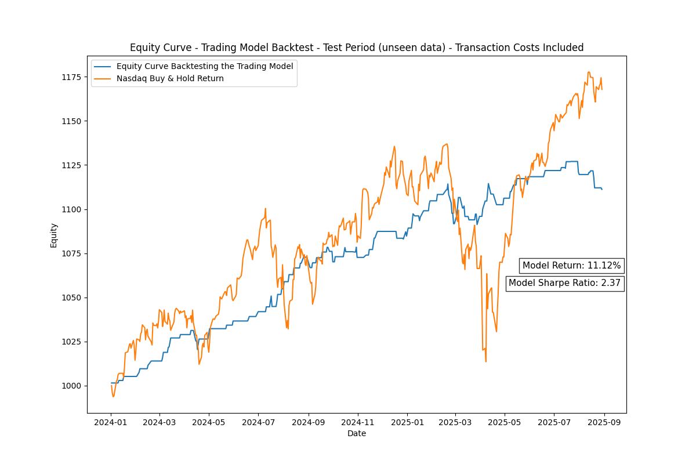

# Nasdaq ML Trading Project

A hybrid machine learning model that predicts the daily high and low 
of the Invesco QQQ ETF and further utilizing this prediction in a trading model.

## Note on Feasibility
The price related data used comes from EODHD and cannot be shared or uploaded due to license restrictions. Therefore, the code is **not directly executable**.
If you want to execute the code yourself you need to get a subscription at EODHD.
--> Click [here](docs/instructions.md) for instructions

As an alternative, I included example outputs (plots in PNG format and metrics in MD format) to illustrate the workflow and results more clearly.
--> See [here](results/results.md)

## Motivation
By building a machine learning-based trading model, I aimed to combine my interests in Data Science, Machine Learning and Finance.
In addition to building the model, I wanted to gain hands-on experience in the full workflow of data handling, feature engineering, model training, validation and backtesting.

## Process
1. Machine Learning Model:
- Data Loading: QQQ OHLCV data and macroeconomic rates
- Data Preprocessing: Combining and cleaning the data from the different sources
- Feature Engineering: Adding lag, timestep and seasonal features
- Model Training and Tuning: Combining a Linear Regression model and an XGBoost model
- Model Testing: Testing the accuracy of the model on unseen data

---> **Daily High and Low predictions**

2. Trading Model:
- Model Building and Tuning: Utilizing the predicted high-low range as the basis for trading decisions
- Model Testing: Backtesting the model on out-of-sample data

## Results
**Evaluation Period: 01.01.2024 - 31.08.2025**
- Out-of-Sample Return: 11.12%
- The model did not yield as good returns as the Nasdaq, though it ensured much lower risk while still achieving a solid return

## Next Steps

- Test the model on real-time data
- Test the effect of leverage on the strategy's risk-return profile, given the model's high Sharpe Ratio

**Click [here](docs/technical_insights.md) to dive deeper into the technical aspects of the project** 